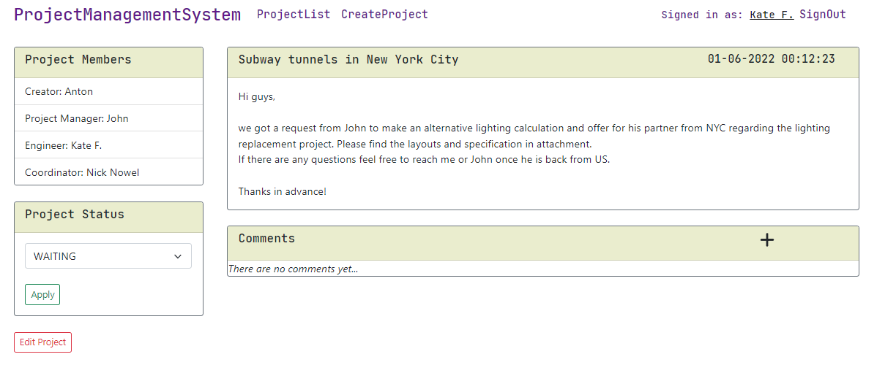
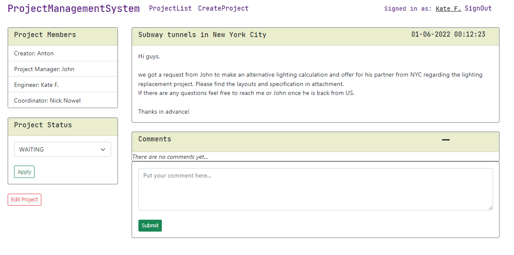

# Project Management System (pms-rest-services)
> Application provides basic functionality for performing management actions on the projects(in a general understanding) via web interface.
> This is completely redesigned RESTfull API version. 
> Previously existed FE part has been cut off and allocated to a separate module implemented from scratch with React.

## Table of contents
* [General info](#general-info)
* [Screenshots](#screenshots)
* [Technologies](#technologies)
* [Features](#features)
* [Status](#status)
* [Contact](#contact)

## General info
The project was conceived as an alternative to the project management system in the company I worked for some years ago. 
The main idea is to implement only the necessary functionality (as opposed to the existing bulky system), 
more user-friendly without overloading the UI and the system as a whole.

## Screenshots

## Technologies
* Java 11
* Spring Boot
* Spring Data JPA
* Spring Security
* Hibernate
* Maven
* MySQL
* Orika Mapper
* Mockito
* Test NG

## Features
List of features ready
* Authentication & authorization system with JWT
* The main screen is a table with a list of projects
* Initially the project creator designates the project roles, which can be changed later by any project member 
* USER has access (see on the list and can open the details) to the project only if he is a member of the particular project
* Project name, description and Project Manager's name are required at the creation stage
* Only a user who actually exists in the database can be added to the project
* Bean validation at the BE side
* Autocomplete for the username inputs
* The following statuses for the project available: - "Waiting", "Processing" and "Closed"
* USERs can leave comments
* Two global roles: USER, ADMIN
* USER's permissions: browse projects list(only projects where user is a member); create/read/update projects; change project status; leave comments on the project; change password via User Profile
* ADMIN's permissions: all USERs permissions + browse all projects (regardless whether he is a member or not); delete projects; delete comments; create/update/edit user; change user's permissions; reset user's password; create/delete project roles

To-do list:
* Filtering by project name
* Attaching files to the project
* Response to a specific comment
* Subtasks on the project
* Logging actions on the project
* Create/delete/edit project statuses via Admin Panel

## Status
Project is: _in progress_

## Contact
Created by Anton Kozhanov [deal.for at gmail.com]