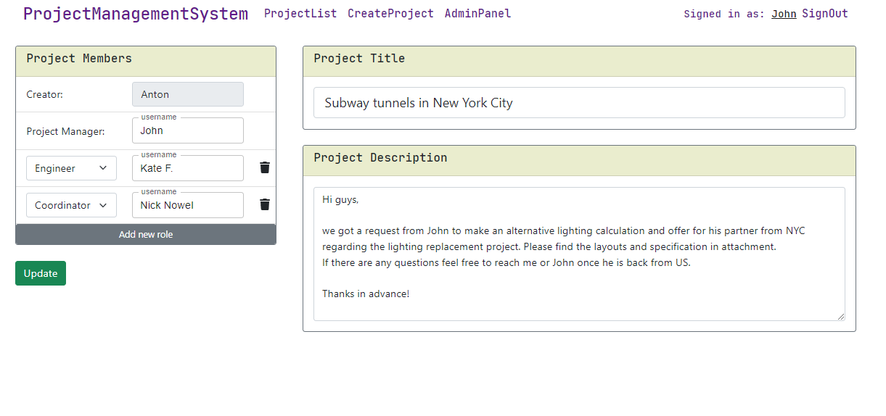

# Project Management System
> Application provides basic functionality for project management via web interface with the ability to assign roles to users on the project, with a task description, and a comment module

## Table of contents
* [General info](#general-info)
* [Screenshots](#screenshots)
* [Technologies](#technologies)
* [Features](#features)
* [Status](#status)
* [Contact](#contact)

## General info
The project was conceived as an alternative to the project management system in the company I'm working for. 
The main idea is to implement only the necessary functionality (as opposed to the existing bulky system), 
more user-friendly without overloading the UI and the system as a whole.

## Screenshots

## Technologies
* Java 8
* Spring Boot - version 2.2.2
* Spring Data JPA - version 2.2.2
* Spring Security - version 5.3.3
* Hibernate - version 5.4.9.Final
* Maven - version 3.6.1
* MySQL - version 5.1
* Freemarker - version 2.3.29
* HTML
* Bootstrap 4
* Java Script

## Features
List of features ready
* Authentication & authorization system
* The main screen is a table with a list of projects
* Filtering by Project Manager or Creator
* Sorting by any column
* Initially the project creator designates the project roles, which can be changed later by any project member 
* USER has access (see on the list and can open) to the project only if he is a member of the particular project
* Project name, description and Project Manager's name are required at the creation stage
* Only a user who actually exists in the database can be added to the project
* Server side input validation
* Autocomplete for the username inputs
* One of the three statuses - "Waiting", "Processing" and "Closed"
* USERs can leave comments
* Two global roles: USER, ADMIN
* USER's permissions: browse projects list(only projects where user is a member); create/read/update projects; change project status; leave comments on the project; change password via User Profile
* ADMIN's permissions: all USERs permissions + browse all projects (regardless whether he is a member or not); delete projects; delete comments; create/update/edit user; change user's permissions; reset user's password; create/delete project roles

To-do list:
* Searching by project name
* Attaching files to the project
* Response to a specific comment
* Subtasks on the project
* Logging actions on the project
* Create/delete/edit project statuses via Admin Panel

## Status
Project is: _in progress_

## Contact
Created by Anton Kozhanov [deal.for at gmail.com]
